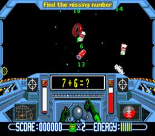
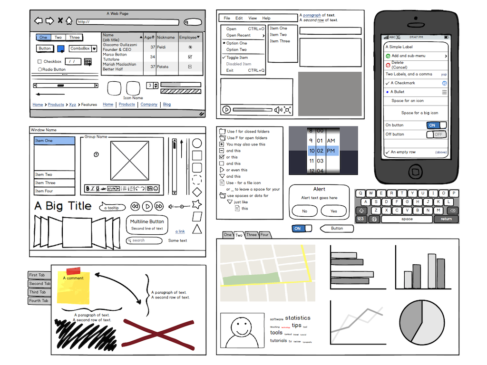
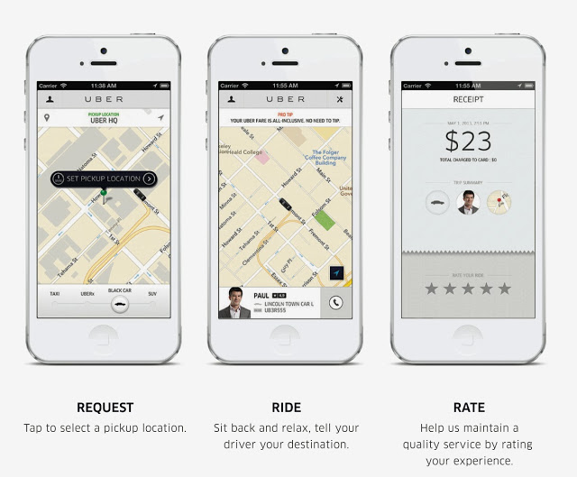
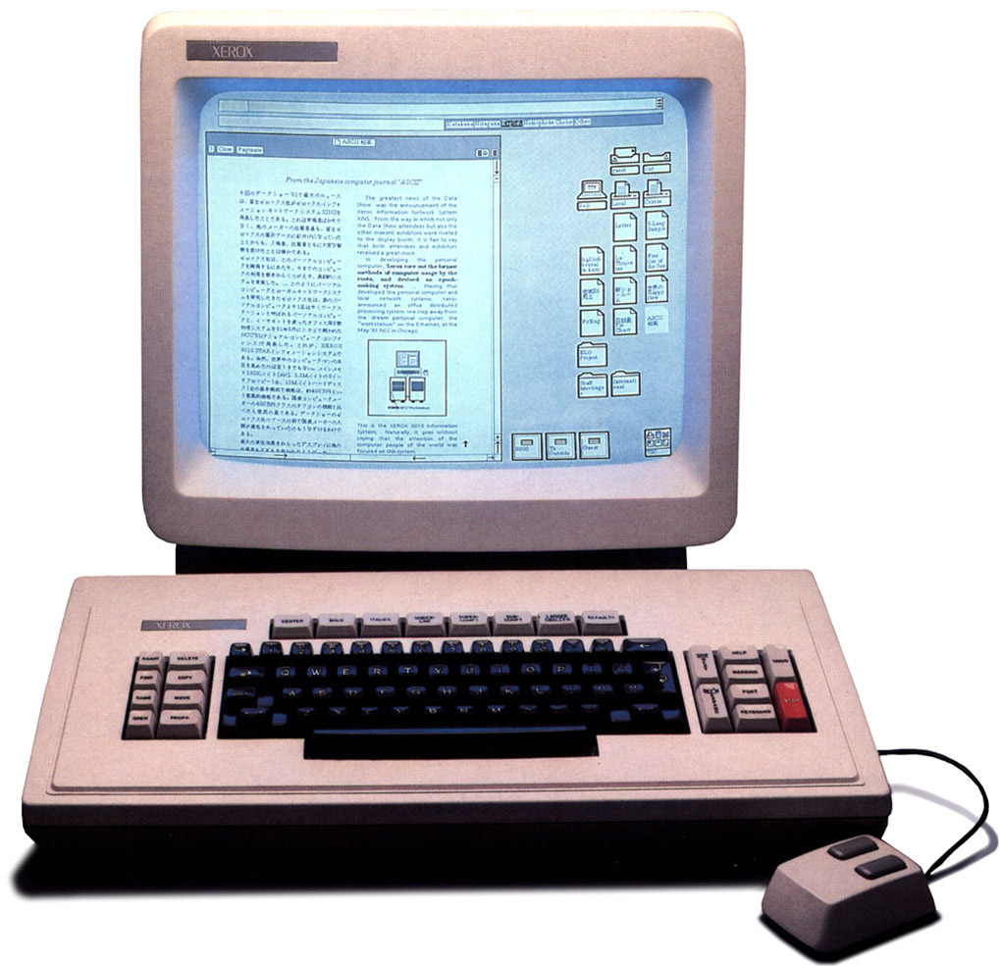

# Ορισμός

"Programming is a way of thinking, not a rote skill. Learning about "for" loops is not learning to program, any more than learning about pencils is learning to draw.", Bret Victor

Η σημασία της διάδρασης του ανθρώπου με μηχανές φαίνεται από την καθιέρωση των υπολογιστικών διεπαφών στις περισσότερες ανθρώπινες δραστηριότητες, από την εργασία, μέχρι την εκπαίδευση και την διασκέδαση. Ο προγραμματισμός της διάδρασης που απαιτείται για την κατασκευή άρτιων διαδραστικών συστημάτων είναι μια σύνθετη έννοια και διαδικασία που απαιτεί δεξιότητες τόσο τεχνολογικές όσο και ανθρωπιστικές. Αν και υπάρχουν πολλοί ικανοί κατασκευαστές συστημάτων, αλλά και γνώστες της ανθρώπινης φύσης και δεξιοτήτων, ο γόνιμος συνδυασμός τους είναι πολύ σπάνιος, και αυτό κυρίως γιατί δεν είναι εύκολο να σκεφτόμαστε σε δύο ανεξάρτητες και πολύ διαφορετικές διαστάσεις (μηχανή, άνθρωπος).

Πηγαίνοντας ένα βήμα ψηλότερα στην ανάλυση της χρησιμότητας του προγραμματισμού της διάδρασης και πέρα από την ανάγκη κατανόησης της λειτουργίας του σύγχρονου ψηφιακού κόσμου, διαπιστώνουμε ότι τόσο οι δεξιότητες που αναπτύσσονται όσο και τα αποτελέσματα του προγραμματισμού της διάδρασης δημιουργούν νέα προϊόντα και υπηρεσίες που επηρεάζουν τις προσωπικές και κοινωνικές αντιλήψεις, συνήθειες, θεσμούς και οργανώσεις. Σε μια εποχή όπου η χρήση του ΗΥ έχει κατηγορηθεί για την αύξηση της ανεργίας μέσω του αυτοματισμού και της αύξησης της παραγωγικότητας, μπορούμε να δούμε αισιόδοξα μια αχαρτογράφητη πτυχή του ΗΥ ως μέσου και εργαλείου δημιουργίας ενός νέου επιπέδου ανθρώπινης δραστηριότητας.

### Ιστορικό και πολιτισμικό πλαίσιο της Διάδρασης

Σε αυτό το μέρος θα μελετήσουμε την ιστορική εξέλιξη της σχεδίασης της διάδρασης ανθρώπου-συσκευών. Το πιο σημαντικό συμπέρασμα είναι ότι, όπως σε πολλές ιστορικές περιπτώσεις, εκ των υστέρων είναι σχετικά κατανοητό γιατί κάποιες σχεδιάσεις είναι καλύτερες από κάποιες άλλες. Ταυτόχρονα, παραμένει πάντα δύσκολο να προβλέψουμε και να σχεδιάσουμε με σιγουριά εκείνες τις μελλοντικές διαδράσεις ανθρώπου-συσκευής που είναι περισσότερο αποτελεσματικές. Αν και ο στόχος αυτός παραμένει άπιαστος, στα επόμενα κεφάλαια θα δούμε ότι τουλάχιστον υπάρχουν οι ανθρωποκεντρικές διαδικασίες οι οποίες αργά ή γρήγορα μας δίνουν σταδιακά καλύτερα λύσεις στα θέματα της διάδρασης με τις συσκευές. Σε κάθε περίπτωση, είναι σκόπιμο να ξέρουμε τι έχουν δοκιμάσει οι σχεδιαστές της διάδρασης στο παρελθόν και γιατί (α)πέτυχε.

Όπως είδαμε στα προηγούμενα ο βασικός στόχος της σχεδίασης της διάδρασης είναι να κατασκευάσουμε συστήματα και συσκευές που να ανταποκρίνονται στις ανάγκες των χρηστών κατά την διαδικασία επίτευξης των στόχων τους σε ένα δεδομένο πλαίσιο χρήσης. Για αυτόν τον σκοπό, οι σχεδιαστές πρέπει να εξετάσουν παράγοντες όπως η ευχρηστία και η μέτρηση της. Αν και η ευχρηστία είναι μια από τις βασικές αξίες της διάδρασης, δεν είναι η μόνη, ενώ η σημασία της μπορεί να είναι πολύ μικρή σε ορισμένες περιπτώσεις. Αν για παράδειγμα το σύστημα διάδρασης έχει εφαρμογή στην ψυχαγωγία (π.χ., εκπαιδευτικά βιντεο-παιχνίδια) τότε θέλουμε η διάδραση να προσφέρει κάτι περισσότερο από απλή ευχρηστία, όπως ψυχαγωγία και μάθηση. Στην περίπτωση βελτίωσης ενός συστήματος που υπάρχει ή είναι παρόμοιο με υπάρχοντα συστήματα, τότε ο πιο απλός τρόπος από πλευράς κόστους, αποτελεσματικότητας και ταχύτητας είναι να βασιστούμε σε επιτυχημένα ιστορικά παραδείγματα.

Τα ιστορικά παραδείγματα διάδρασης με συσκευές χρήστη σε ορισμένες περιπτώσεις έχουν κάποιες επικαλύψεις χρονικά ή στα χαρακτηριστικά τους, όμως, είναι όσο γίνεται περισσότερο ανεξάρτητα. Από την μία πλευρά η χρονολογική επισκόπηση είναι μια ενδιαφέρουσα ιστορική αναδρομή στην τεχνολογική εξέλιξη με έμφαση στην διάδραση, αλλά ταυτόχρονα είναι και μια εργαλειοθήκη για τον μελλοντικό σχεδιαστή της διάδρασης. Ειδικά, εστιάζουμε στην εξέλιξη των διαδραστικών συστημάτων και πως έχουν αυξήσει την χρησιμότητα και την ευχρηστία των υπολογιστών.

Το πιο χαρακτηριστικό παράδειγμα διάδρασης είναι αυτό του επιτραπέζιου υπολογιστή και της γραφικής επιφάνειας εργασίας, που ελέγχεται από τον χρήση με τις συσκευές εισόδου πληκτρολόγιο και ποντίκι. Αυτή η μορφή υπολογιστή και διάδρασης είναι ενδιαφέρουσα γιατί ήταν η πρώτη μορφή υπολογιστή που ξέφυγε από τις μέχρι τότε πολύ εξειδικευμένες εφαρμογές των υπολογιστων (π.χ., βάσεις δεδομένων) και μπόρεσε να διευκολύνει τις εργασίες και την καθημερινότητα σε πάρα πολλούς χρήστες (π.χ., επεξεργασία κειμένου, ανάκτηση πληροφορίας από τον ιστό, και επικοινωνία με ηλεκτρονικό ταχυδρομείο). Αν και το μοντέλο διάδρασης με τον επιτραπέζιο υπολογιστή δεν είναι ούτε τόσο δημοφιλές ούτε τόσο εύκολο όσο αυτό του κινητού υπολογισμού με τα έξυπνα κινητά και τις ταμπλέτες, έχει ιδιαίτερο ενδιαφέρον γιατί έχει μείνει σχετικά ίδιο από τότε που δημιουργήθηκε, πράγμα που επιβεβαιώνει ότι ανεξάρτητα από την ραγδαία τεχνολογική εξέλιξη η ανθρώπινη διάδραση κινείται σε πιο αργούς ρυθμούς.

### Ψηφιακός αλφαβητισμός, παραγωγικότητα, και προσωπική έκφραση

Γνωστική, συναισθηματική και κοινωνική επαύξηση, προσωπική έκφραση και δημιουργικότητα, ιδιωτικότητα και ασφάλεια, προσωπική ταυτότητα, βιωσιμότητα

Ο ψηφιακός αλφαβητισμός είναι καθολικά αποδεκτός ως μια πολύ βασική δεξιότητα ανεξάρτητα από τις προσωπικές και επαγγελματικές επιδιώξεις του κάθε ανθρώπου.

### Ο Ανθρωπος, ο Υπολογιστής και η Διάδραση τους

O ένας πυλώνας του γνωστικού αντικειμένου είναι η διάδραση που συμβαίνει ανάμεσα σε έναν τουλάχιστον άνθρωπο και σε μία ή περισσότερες συσκευές. Με αυτές τις γνώσεις σε αυτήν την ενότητα μπορούμε να μελετήσουμε πως ο άνθρωπος χρησιμοποιεί τις συσκευές κυρίως ως εργαλεία, αλλά και ως μέσα επικοινωνίας, ψυχαγωγίας, και συνεργασίας. Αυτή η επικοινωνία ανάμεσα στον άνθρωπο και τις συσκευές ονομάζεται διάδραση. Σε αυτήν τήν ενότητα θα μελετήσουμε τα είδη της διάδρασης, τα στοιχεία που την συνθέτουν, καθώς και το φυσικό, κοινωνικό, και οργανωσιακό πλαίσιο μέσα στο οποίο μπορεί να συμβεί. Ακόμη, θα εξετάσουμε πόσο καλά μπορούν να υποστηρίξουν τις ανθρώπινες διαδικασίες τα διαφορετικά είδη της διάδρασης.

Υπάρχουν πολλοί τρόποι διάδρασης του χρήστη με την συσκευή. Αρχικά, από την μια πλευρά, είχαμε την γραμμή εντολών καθώς και τις εντολές δέσμης (batch processing) που είναι πολύ αποτελεσματικοί τρόποι για επαναλαμβανόμενες και σταθερές οδηγίες προς την συσκευή. Αν όμως οι οδηγίες προς την συσκευή και το σύστημα πρέπει να αλλάζουν συχνά και είναι περισσότερο δυναμικές, τότε, από την άλλη πλευρά, έχουμε τον απευθείας χειρισμό και την εικονική πραγματικότητα, όπου η διάδραση γίνεται δυναμικά και οι χρήστες λαμβάνουν συνέχεια ανατροφοδότηση. Στο ενδιάμεσο αυτών των ακραίων τύπων διάδρασης (γραμμή εντολής και απευθείας χειρισμός) υπάρχει ένα φάσμα από τύπους διάδρασης, καθώς και οι τύποι διάδρασης που εμφανίζονται με τις κινητές εφαρμογές και τις συσκευές διάχυτου υπολογισμού.

### Προσωπικές δεξιότητες

Γλώσσες προγραμματισμού, μεθοδολογία, τεχνικές, εργαλεία, δεξιότητες

Με δεδομένη την ανάγκη ανάπτυξης δεξιοτήτων που θεμελιώνουν τον ψηφιακό αλφαβητισμό πέρα από την απλή χρήση προς την βαθύτερη κατανόηση λειτουργίας και ιδανικά την δημιουργία νέων διαδράσεων, ένα ερώτημα που προκύπτει οργανικά αφορά την επιλογή του εργαλείου, την οργάνωση, αλλά και την διαδικασία δημιουργίας της διάδρασης. Για αν απαντήσουμε σε αυτό το ερώτημα θα πρέπει να ανατρέξουμε στην φύση του προγραμματισμού της διάδρασης. Το βασικό στοιχείο αυτής της περιοχής είναι ότι οι τελικές προδιαγραφές του συστήματος μας δεν είναι καθόλου γνωστές στην αρχή, ενώ είναι σίγουρο ότι ακόμη και θα έχουμε τις πρώτες εκδόσεις σε χρήση, οι προδιαγραφές θα συνεχίζουν να αλλάζουν ανάλογα με την χρήση. Επομένως, τα κατάλληλα εργαλεία, διαδικασίες, και δομές θα πρέπει να μπορούν να αλλάζουν γρήγορα τόσο τα ίδια όσο και τα δημιουργήματα τους.

Σε μια πρώτη ανάγνωση, ο προγραμματισμός της διάδρασης φαίνεται ως το άθροισμα ή ίσως η τομή των επιμέρους περιοχών του προγραμματισμού ΗΥ και της διάδρασης ανθρώπου-υπολογιστή.  Στην πράξη όμως η πρόσθεση των γνώσεων προγραμματισμού με αυτές τις διάδρασης ανθρώπου-υπολογιστή δεν είναι ικανή συνθήκη για την δημιουργία νέων κατεσκευών που θα επαναπροσδιορίζουν τις ανθρώπινες και κοινωνικές δραστηριότητες. Αν και είναι σίγουρα αναγκαία συνθήκη να υπάρχουν οι βασικές επιμέρους γνώσεις, είτε αυτές οι γνώσεις βρίσκονται στον ίδιο άνθρωπο, είτε είναι ρόλοι σε μια ομάδα συνεργασίας, υπάρχει η επιπλέον η ανάγκη για γνώσεις σε ένα υψηλότερο επίπεδο, αυτό του προγραμματισμού της διάδρασης. Σε αυτό το υψηλότερο επίπεδο αφαίρεσης των επιμέρους λεπτομερειών έχουμε την δυνατότητα να εστιάσουμε την προσοχή μας στα εργαλεία, τις δομές, και τις διαδικασίες που θα δώσουν δημιουργικές λύσες σε υπάρχοντα προβλήματα, και κυρίως θα επαυξήσουν τις δυνατότητες μας.

Όπως οι οπτικές γλώσσες προγραμματισμού υψηλού επιπέδου (π.χ., Scratch) έχουν μικρή μόνο σχέση με τις αντίστοιχες γλώσσες προγραμματισμού που είναι κοντά στην μηχανή (π.χ., Assembly, C), έτσι και ο προγραμματισμός της διάδρασης έχει μικρή μόνο σχέση με τις βασικές επιμέρους περιοχές. Στην πράξη, ο προγραμματιστής της διάδρασης είναι χρήσιμο να ξέρει τις βασικές έννοιες του προγραμματισμού, όπως είναι η μεταβλητή και οι συνθήκες, αλλά από εκεί και πέρα η δεξιότητα του θα αυξηθεί μόνο αν μάθει να χρησιμοποιεί νέες βιβλιοθήκες και εργαλεία, παρά αν μάθει όλες τις λεπτομέρειες που κάνουν ένα πρόγραμμα υπολογιστή αποδοτικό (π.χ., ταχύτητα, μνήμη). Επομένως, αν και μιλάμε για προγραμματισμό της διάδρασης, στην πράξη ο προγραμματισμός αυτός όπου υπάρχει αφορά περισσότερο την δημιουργική σύνθεση και χρήση έτοιμων βιβλιοθηκών και εργαλείων με απλές δομές ελέγχου, με τελικό σκοπό την επαύξηση των ανθρώπινων και κοινωνικών δραστηριοτήτων.

Οι βασικές τεχνολογίες και ο αντίστοιχος προγραμματισμός της δικτύωσης, της αποθήκευσης και επεξεργασίας δεδομένων, και κυρίως της εισόδου και εξόδου πληροφορίας σε σχέση με τον άνθρωπο είναι τα δομικά στοιχεία, και επομένως θέλουμε άμεση και εύκολη πρόσβαση σε όλα αυτά μαζί χωρίς να πρέπει να ανησυχούμε για τις λεπτομέρειες της υλοποίησης. Αν και οι λεπτομέρειες της υλοποίησης θα έχουν μεγάλη σημασία όταν το σύστημα μας βρίσκεται στις ζωές πολλών ανθρώπων, σε αυτήν την φάση της ανάπτυξης, κατά την οποία δεχόμαστε ότι δεν ξέρουμε ακριβώς τι είναι αυτό που ετοιμάζουμε ούτε πως (και αν) θα επηρεάσει την καθημερινότητα του ανθρώπου, είναι σκόπιμο να μην ασχοληθούμε με αυτές τις λεπτομέρειες. Με αυτό το δεδομένο, η επιλογή των εργαλείων ανάπτυξης και ειδικά της γλώσσας προγραμματισμού και των βιβλιοθηκών απλουστεύεται, αλλά σε καμία περίπτωση δεν μπορεί να χαρακτηριστεί εύκολη όπως θα δούμε στο αντίστοιχο κεφάλαιο της κατασκευής της διάδρασης.

### Κατασκευή πρωτοτύπου και επανάληψη

Εφικτές απαιτήσεις πληροφοριακού συστήματος, Η περιοχή της μηχανικής του λογισμικού

Αν και υπάρχουν πάρα πολλές τεχνικές και μεθοδολογίες, και ακόμη περισσότερα εργαλεία και δομές για τον προγραμματισμό της διάδρασης, αν έπρεπε να τα συνοψίσουμε όλα σε μια πρόταση θα λέγαμε ότι αυτή είναι η επαναληπτική κατασκευή ενός πρωτοτύπου. Αυτή η επανατοποθέτηση του προβλήματος της διαδικασίας κατασκευής μας επιτρέπει να στρέψουμε την προσοχή μας στην φύση και στον ρόλο του πρωτοτύπου. Η διαδικασία κατασκευής του πρωτοτύπου είναι χρήσιμη ως μηχανισμός κατανόησης της διάδρασης που θέλουμε να υλοποιήσουμε, ενώ όταν το πρωτότυπο είναι σε μια πρώτη ικανοποιητική μορφή τότε το ίδιο το πρωτότυπο μπορεί να χρησιμοποιηθεί για δοκιμές με τους τελικούς χρήστες ή ακόμη και να χρησιμοποιηθεί ώς αρχική έκδοση (π.χ., έκδοση άλφα, βήτα, από την ορολογία της τεχνολογίας λογισμικού). Αυτή η προσέγγιση είναι γνωστή στην βιβλιογραφία και ως το πρωτότυπο ως προδιαγραφές, δηλαδή αντί να ετοιμάσουμε ένα λεπτομερές συμβόλαιο που θα περιγράφει με λέξεις και διαγράμματα το αποτέλεσμα, έχουμε το ίδιο το αποτέλεσμα (εν τη γεννέσι του) ως προδιαγραφές. Αυτό είναι μια σχετικά απλή ιδέα που φέρνει σε μεγάλη αντίθεση την περιοχή του προγραμματισμού της διάδρασης με άλλες συγγενείς περιοχές της επιστήμης του μηχανικού, ακόμη και με τις γονικές περιοχές της τεχνολογίας λογισμικού, και αποδικνύει τον κεντρικό ισχυρισμό αυτού του βιβλίου ότι ο προγραμματισμός της διάδρασης είναι μια νέα περιοχή που ναι μεν έχει αρκετές ομοιότητες με άλλες, αλλά τελικά έχει τόσες διαφορές που απαιτούν ουσιαστικά διαφορετική αντιμετώπιση.

Το πρωτότυπο θα πρέπει να είναι διαδραστικό, διαφορετικά είναι σκόπιμο να το χαρακτηρίσουμε απλά ως ένα αρχικό προσχέδιο. Τα αρχικά προσχέδια είναι και αυτά πολύ χρήσιμα για την καλύτερη κατανόηση της διάδρασης και κυρίως για την επικοινωνία με άλλα μέλη της ομάδας ανάπτυξης. Τα αρχικά προσχέδια συνήθως μπορούν να έχουν την μορφή του αφηγηματικού σεναρίου και των ενδεικτικών οθονών, αλλά υπάρχουν και άλλες επιλογές όπως το κόμικ (storyboard), το βίντεο, οι διαδραστικές διαφάνειες, και πολλά άλλα εξειδικευμένα εργαλεία κατασκευής προσχεδίου για το πρωτότυπο. Τα προσχέδια και τα πρωτότυπα κάθε άλλο παρά δεν είναι κάτι καινούριο στην περιοχή των μηχανικών. Για παράδειγμα, οι αρχιτέκτονες μηχανικοί ξεκινάνε την σχεδίαση στο χαρτί, γιατί αυτός είναι ο πιο γρήγορος τρόπος αναπαράστασης μια ιδέας και επίσης βοηθάει και στην σχεδιαστική σκέψη. Αντίστοιχα, ο προγραμματισμός της διάδρασης είναι σκόπιμο να ξεκινήσει από ένα σύντομο αφηγηματικό σενάριο, το οποίο θα πρέπει να συνοδεύεται και από μερικές ενδεικτικές οθόνες. Αν και υπάρχουν ομοιότητες με τους αρχιτέκτονες μηχανικούς, υπάρχουν και σημαντικές διαφορές, γιατί το αποτέλεσμα του προγραμματισμού της διάδρασης δεν είναι κάτι στέρεο και σταθερό, αλλά είναι κάτι ρευστό που αλλάζει συνέχεια ανάλογα με την χρήση. Επομένως, τόσο τα προσχέδια όσο και τα πρωτότυπα θα πρέπει να αντικατοπτρίζουν αυτήν την κίνηση, κάτι που δύσκολα μπορεί να γίνει με το χαρτί ή τις απλές εικόνες. Για αυτό στα προσχέδια του προγραμματισμού της διάδρασης θέλουμε να έχουμε τουλάχιστον ένα σενάριο και ενδεικτικές οθόνες ώστε να μπορεί ο σχεδιαστής και οι άλλοι ρόλοι να φανταστούν το τελικό προϊόν.

Οι διαφορές στην κατασκευή του πρωτοτύπου με τους αρχιτέκτονες δεν συνεχίζονται στην περίπτωση της μακέτας. Ενώ η μακέτα είναι για τους αρχιτέκτονες μηχανικούς ένα προχωρημένο πρωτότυπο που αναπαριστά στον πραγματικό χώρο, έστω και σε μικρό μέγεθος, το τελικό προϊόν, στην περίπτωση του προγραμματισμού της διάδρασης, ένα διαδραστικό πρωτότυπο είναι το ίδιο το τελικό το προϊόν. Η μεγαλύτερη διαφορά όμως σε σχέση με τους αρχιτέκτονες μηχανικούς και τις συγγενείς επιστήμες του μηχανικού είναι ότι ένα διαδραστικό πρωτότυπο και φυσικά το τελικό προϊόν δεν είναι καθόλου διακριτά στάδια στην διαδικασίας σχεδίασης, παραγωγής, και βελτίωσης. Για παράδειγμα, η πρώτη εμπορική έκδοση του δημοφιλούς Apple iPhone δεν είχε εφαρμογές από την πλευρά εξωτερικών παραγωγών, αλλά μόνο τις επίσημες εφαρμογές της εταιρείες. Ηταν αυτό το τελικό προϊόν ή ένα προχωρημένο πρωτότυπο? Από την πλευρά του υλικού η συσκευή μπορεί να βελτιώθηκε σταδιακά, όμως από την πλευρά του λογισμικού η δυνατότητα να μπαίνουν νέες εφαρμογές ήταν ουσιαστικά ένα νέο προϊόν, άρα δεν θα μπορούσαμε να κατατάξουμε το πρώτο εμπορικό iPhone ώς ένα προχωρημένο διαδραστικό πρωτότυπο των σύγχρονων iPhone, τα οποία δεν έχουν πάψει να εξελίσσονται, σε συνδυασμό τόσο με το λογισμικό που προστείθεται αλλά και κυρίως με νέο εξωτερικό υλικό, όπως αυτό που διευκολύνει σημαντικές ανθρώπινες δραστηριότητες που έχουν να κάνουν με τις συναλλαγές, την υγεία, την δημιουργία, και την διασκέδαση.

Συνοπτικά, η κεντρική διαφορά του προγραμματισμού της διάδρασης από άλλες επιστήμες του μηχανικού είναι ότι η διαδικασία ανάπτυξης και η τελική κατασκευή βρίσκονται σε ένα συνεχή κύκλο. Για παράδειγμα, η δημοφιλής υπηρεσία Google Mail για πολλά χρόνια είχε την ετικέτα βήτα (beta), ενώ ήταν πλήρως λειτουργική. Βλέπουμε λοιπόν, ότι στην περίπτωση του λογισμικού οι επίσημες "τελικές" εκδόσεις είναι απλά προφορικές ή γραπτές δηλώσεις του κατασκευαστή, σε αντίθεση με ένα σπίτι που η παράδοση του λίγο θα διαφέρει από τις μετατροπές του, ακόμη και μετά από πολλά χρόνια. Το συμπέρασμα που αξίζει να μείνει είναι ότι η διαδικασία της κατασκευής στην περιοχή του προγραμματισμού της διάδρασης είναι ένας κύκλος επανάληψης που είναι πολύ δύσκολο να προσδιορίσουμε πότε ακριβώς αρχίζει και πότε τελειώνει, ακόμα και ειδικά για τα προϊόντα που είναι σε ευρεία χρήση, αφού αυτή η ίδια η χρήση τους επαναπροσδιορίζει την φύση τους σε ένα αέναο κύκλο. Κάποιος θα μπορούσε να υποστηρίξει ότι όλα αυτά δεν είναι καθόλου νέα, και ότι όλες οι παραδοσιακές βιομηχανίες (κτήρια, αυτοκίνητα) σταδιακά μεταλλάσσονται για να εξυπηρετήσουν τους χρήστες τους. Αυτό είναι αλήθεια, αλλά οι αλλαγές που συνήθως συμβαίνουν σε όλες τις παραπάνω βιομηχανίες είναι τόσο σταδιακές χρονικά και τόσο προσθετικές δομικά, όπου και πάλι αναδεικνύεται αυτή η ιδιαιτερότητα του προγραμματισμού της διάδρασης σε σχέση με τις πολύ συγγενείς περιοχές, αυτήν την φορά αναφορικά με την διαδικασία κατασκευής.

### Η διάδραση ανθρώπου-υπολογιστή σε μεγαλύτερη κλίμακα

### Εργασία σε ομάδες

Μια πολύ σημαντική εφαρμογή των υπολογιστών είναι στην διευκόλυνση της επικοινωνίας και της συνεργασίας μικρών ομάδων ανθρώπων. Πριν κατασκευάσουμε ένα σύστημα που θα διευκολύνει την εργασία σε ομάδες, θα πρέπει πρώτα να κατανοήσουμε τον ρόλο του κάθε μέλους της ομάδας στις κοινές διεργασίες. Αν και η σημασία της κοινωνικής διάστασης ήταν γνωστή από πολύ καιρό σε γειτονικές περιοχές, η εξειδικευμένη περιοχή των κοινωνικών και συνεργατικών συστημάτων δημιουργήθηκε στα τέλη της δεκαετίας του 1980. Αρχικά, οι μελέτες ασχολήθηκαν με τις ανάγκες που προκύπτουν κατά την συνεργασία στον χώρο της εργασίας με επιτραπέζιους υπολογιστές και ενσύρματα δίκτυο, όμως πολύ γρήγορα το ενδιαφέρον αυτής της περιοχής στράφηκε προς τον κινητό υπολογισμό, τα κοινωνικά δίκτυα, και τα δικτυακά βίντεο-παιχνίδια ρόλων. Τέλος, πρέπει να τονιστεί ότι οι εφαρμογές αυτής της περιοχής δεν περιορίζονται πλέον μόνο στο πεδίο της εργασίας, αλλά έχουν επεκταθεί σε πολλές ακόμη σημαντικές κοινωνικές δραστηριότητες, όπως είναι η εκπαίδευση.

Η θεωρία για την διάδραση ανθρώπου-υπολογιστή εμφανίζεται με διαφορετικές μορφές σε πολλές διαφορετικές περιοχές οι οποίες έχουν σχετικά διαφορετικούς στόχους. Για παράδειγμα, η εργονομία έχει εστιάσει κυρίως στις σωματικές εργασίες των ανθρώπων που δουλεύουν με βιομηχανικές μηχανές, ρομπότ, καθώς και στην είσοδο δεδομένων και τον χειρισμό εξοπλισμού ασφαλείας (π.χ., αεροσκάφη, πλοία, συστήματα ενέργειας, κτλ). Από την άλλη πλευρά, η περιοχή των πληροφοριακών συστημάτων διοίκησης λειτουργεί σε μεγαλύτερη κλίμακα, όπου πολλοί άνθρωποι συνεργάζονται ως μέλη επιμέρους ομάδων για να πάρουν αποφάσεις και να πετύχουν έναν κοινό σκοπό, στο πλαίσιο ενός ή περισσότερων διασυνδεδεμένων οργανισμών και ιεραρχιών αποφάσεων. Ανάμεσα στα δύο άκρα της κλίμακας της διάδρασης (άνθρωπος-υπολογιστής και οργανισμός που συντονίζει ομάδες ανθρώπων) βρίσκεται η σχετικά πιο νέα περιοχή των κοινωνικών και συνεργατικών συστημάτων, όπου η διάδραση συμβαίνει ανάμεσα στα μέλη μιας μικρής ομάδας (δύο ως πέντε άνθρωποι), η οποία συντονίζεται με την βοήθεια ενός ή περισσότερων υπολογιστών. Φυσικά, ο διαχωρισμός ανάμεσα στις παραπάνω περιοχές δεν είναι απόλυτα στεγανός και υπάρχουν αρκετές επικαλύψεις ανάμεσα τους.

### Τα προϊόν της διάδρασης ως υπηρεσία και αγαθό

Το λειτουργικό σύστημα των επιτραπέζιων υπολογιστών αρχικά ήταν προς πώληση ώς προϊόν συσκευασμένο σε ένα κουτί, όμως, σταδιακά έγινε αντιληπτό ότι το περιεχόμενο του κουτιού ποτέ δεν ήταν τελικό, ενώ η ανάπτυξη του διαδικτύου ως κανάλι διανομής επέτρεψε στο λογισμικό να πάρει την θέση που του ταιριάζει περισσότερο ως υπηρεσία, αν και πάντα υπάρχει μια υβρική ισορροπία ανάμεσα στα δύο, ειδικά στην περίπτωση που συνοδεύεται από κάποια συσκευή. Διαπιστώνουμε ότι το λογισμικό είναι αρκετά διαφορετικό από άλλα προϊόντα και υπηρεσίες αναφορικά με τις παρακάτω ιδιότητες: 1) πνευματική ιδιοκτησία, 2) εμπορευσιμότητα, τα οποία μελετάμε στα επόμενα.

Υπάρχουν πολλά είδη δικαιωμάτων πνευματικής ιδιοκτησίας, όπως είναι τα trademark, patent, copyright. Τα περισσότερα έργα λογισμικού αντιμετωπίζονται όπως τα λογοτεχνικά βιβλία και έχουν copyright, αν και υπάρχουν περιπτώσεις στο λογισμικό της διεπαφής ανθρώπου-υπολογιστή όπου έχει γίνει προσπάθεια για πατέντα. Για παράδειγμα, στα τέλη της δεκαετίας του 1980 η Apple προσπάθησε να προστατεύσει το γραφικό περιβάλλον εργασίας απέναντι στον ανταγωνισμό από την Microsoft. Επειδή το λογισμικό δεν είναι ούτε βιβλίο αλλά ούτε και βιομηχανικό αντικείμενο τα υπάρχοντα είδη πνευματικής ιδιοκτησίας ίσως να μην ταιριάζουν απόλυτα. Αλλωστε αυξάνονται οι περιπτώσεις όπου το λογισμικό δίνεται με άδεια ανοικτού κώδικα ή παρέχει κάποιο API και στην συνέχεια ο δημιουργός αναζητεί αμοιβή μέσα από την πώληση της τεχνογνωσίας του. Οσο χαρακτηριστική είναι η περίπτωση των αυτοδημιούργητων κλειστού κώδικα όπως ο Bill Gates της Microsoft άλλο τόσο ενδιαφέρουσα είναι η περίπτωση του ανοικτού κώδικα με τον Linus Torvalds του Linux που επέλεξε να δώσει δωρεάν τον καρπό της προσπάθειας του. Και στις δύο περιπτώσεις είχαμε την δημιουργία μιας πολύ μεγάλης βιομηχανίας και πολλών θέσεων εργασίας, αν και η προσέγγιση του καθένα ήταν αντιδιαμετρικά αντίθετη.

Η εμπορευσιμότητα ενός αγαθού ή υπηρεσίας εξαρτάται από πολλούς παράγοντες, αλλά ο σημαντικότερος είναι η δυνατότητα που υπάρχει για εύκολη γεωγραφική διανομή. Το λογισμικό αν και ξεκίνησε ως μέρος του υλικού στην συνέχεια έγινε δίσκος που αγοραζόταν από τα ράφια του λιανεμπορίου, τον τελευταίο καιρό έχει μετατραπεί σε υπηρεσία που είναι διαθέσιμη στο δίκτυο. Στη ίδια συζήτηση έχει ενδιαφέρον και η δουλειά του προγραμματιστή λογισμικού και η δυνατότητα καθώς και ο κίνδυνος από την εμπορευσιμότητα αυτής της εργασίας. Για παράδειγμα μια υπηρεσία στο Web είναι διαθέσιμη παντού, πράγμα που σημαίνει ότι τελικά θα πρέπει να ανταγωνιστεί αντίστοιχες προσπάθειες από όπου και αν έρχονται, πχ. από τις ανεπτυγμένες ΗΠΑ ή από τις χώρες με το εξειδικευμένο εργατικό δυναμικού χαμηλού κόστους όπως η Ινδία. Πέρα από τις ευκαιρίες για μια διευρυμένη αγορά, μέσα σε αυτό το παγκοσμιοποιημένο πλαίσιο είναι μάλλον αφελές να κρατάμε κλειστή την διεπαφή με ένα λογισμικό, αφού μέσα σε μικρό σχετικά χρονικό διάστημα κάποιος μπορεί να φτιάξει κάτι παρόμοιο ή ακόμη και καλύτερο. Μια περισσότερο αποτελεσματική στρατηγική είναι να κάνουμε διαθέσιμο τον πηγαίο κώδικα (ελπίζοντας σε συνεισφορές και βελτίωση του) και ταυτόχρονα να μαθαίνουμε από τις διαδράσεις που κάνουν οι χρήστες, έτσι ώστε να βελτιώνουμε την υπηρεσία και, κυρίως, έτσι ώστε να αυξάνουμε την γνώση που έχουμε για το τι συνηστά ανά πάσα στιγμή μια χρήσιμη και επιθυμητή υπηρεσία.

Από την άλλη πλευρά, το λογισμικό είναι παρόμοιο με την μηχανή εσωτερικής καύσης και την βιομηχανική ρομποτική αναφορικά με την αυτοματοποίηση της ανθρώπινης δραστηριότητας. Η αυτοματοποίηση θεωρείται συνήθως μια αρετή αφού επιτρέπει στον άνθρωπο να ασχοληθεί με κάτι άλλο πέρα από τις μηχανικές, επίπονες, και επαναλαμβανόμενες διεργασίες. Στην πράξη έχει επιτρέψει την μετάβαση από την αγροτική στην βιομηχανική και αργότερα εποχή των υπηρεσιών. Η άλλη όψη του νομίσματος όμως περιγράφει μια συνήθως επίπονη περίοδο μετάβασης από την μια εποχή στην επόμενη. Ετσι ακριβώς όπως οι μηχανές εσωτερικής καύσης διευκόλυναν την εργασία και αύξησαν την παραγωγικότητα κατά την μετάβαση από την αγροτική στην βιομηχανική εποχή, όπως η ρομποτική και ο αυτοματισμός μείωσαν στην συνέχεια την ανάγκη για ανθρώπινη εργασία στα εργοστάσια. Με τον ίδιο τρόπο ακριβώς το λογισμικό διάδρασης έρχεται να αυτοματοποιήσει πάρα πολλές εργασίες που γίνονταν με την μεσολάβηση ανθρώπων στην βιομηχανία των υπηρεσιών (π.χ., τράπεζες, ασφάλεια, ταξίδια, κτλ). Αν η ιστορία είναι σωστός οδηγός, τότε θα πρέπει να αναζητήσουμε την επόμενη βιομηχανική επανάσταση ανάμεσα στις δυνατότητες που μας προσφέρει ο προγραμματισμός της διάδρασης για νέες υπηρεσίες και αγαθά, τα οποία με την σειρά τους θα ορίσουν μια νέα αγορά.

### Η οικονομία του διαδικτύου

Οι πιο πρόσφατες επιχειρήσεις και οργανισμοί που δημιουργήθηκαν μετά την διάχυση του διαδικτύου ακολουθούν μια περισσότερο ανοικτή προσέγγιση στην προστασία της πνευματικής ιδιοκτησίας τους. Για παράδειγμα, υπάρχουν πολλές περιπτώσεις, όπως η Google και το Twitter όπου τμήματα από τον πηγαίο κώδικα ή/και μέρος των δεδομένων που συλλέγουν δίνεται δωρεάν σε όλους. Το βασικό κίνητρο αυτής της ομάδας των εταιρειών είναι να προστατεύσουν και να αυξήσουν τους δεσμούς που έχουν με τους χρήστες τους και κυρίως με το εξωτερικό οικοσύστημα εφαρμογών λογισμικού των συνεργατών τους. Όσο περισσότερες εφαρμογές φτιαχτούν που στηρίζονται στα δεδομένα και τις εφαρμογές αυτών των εταιριών, τόσο περισσότερο αυξάνεται η αξία της πνευματικής ιδιοκτησίας αυτών των εταιριών. Αν και σε αναλογία με την ιδιοκτησία υλικών αγαθών είναι αντιφατικό να λέμε ότι η αξία της ιδιοκτησίας αυξάνεται αν την μοιραζόμαστε, αυτό είναι τελικά που ισχύει σε πολλές από τις επιτυχημένες περιπτώσεις ετερόκλητων (π.χ., κερδοσκοπικών ή μη) οργανισμών που βασίζονται στην διάδραση με τους χρήστες τους όπως είναι η Wikipedia και το Facebook.

Η διαφορά των δύο περιπτώσεων μπορεί να εξηγηθεί εν μέρει από την αντιμετώπιση που έχει η κάθε μια στην δημιουργία πρόσθετης αξίας και πλούτου. Συνήθως, οι εταιρείες στο παρελθόν εντοπίζουν και ορίζουν αυστηρά μια αγορά (ανταγωνιστές, προμηθευτές, πελάτες) και προσπαθούν να πάρουν όσο γίνεται μεγαλύτερο μερίδιο ή έστω να εξυπηρετήσουν εστιασμένα ένα κομμάτι της. Για παράδειγμα, η κατασκευή λογισμικού λειτουργικού συστήματος από τις Microsoft και Apple αντιμετώπιζε για πολλά χρόνια τους επιτραπέζιους υπολογιστές ως μια πίτα όπου ο καλύτερος θα κέρδιζε το μεγαλύτερο κομμάτι. Από την στιγμή όμως ο επιτραπέζιος υπολογιστής έγινε απλά μια μικρή απόχρωση στο ευρύ φάσμα των υπολογιστών που χρησιμοποιούν οι χρήστες, πλέον η αγορά επαναπροσδιορίζεται στο επίπεδο των υπηρεσιών για το σύνολο των κινητών και διάχυτων συσκευών του χρήστη, με το λειτουργικό σύστημα να μπαίνει σε δεύτερο ρόλο ή/και να προσφέρεται δωρεάν προκειμένου ο χρήστης να κατευθυνθεί προς τις αντίστοιχες υπηρεσίες πρόσθετης αξίας όπως είναι η επικοινωνία, η κοινωνική δικτύωση, η ανάκτηση πληροφορίας, κτλ.

### Η επόμενη βιομηχανική επανάσταση

Σε αυτήν την ενότητα περιγράφουμε τις ιδιότητες που παρουσιάζει μια γενιά επιχειρήσεων και οργανισμών που προσπαθούν να μεγιστοποιήσουν τους δεσμούς τους με άλλους συγγενείς οργανισμούς. Το όραμα τους είναι μια διαφορετική φιλοσοφία για την ιδιοκτησία και την αξία, ενώ ο ακρογωνιαίος λίθος για αυτό το οικοδόμημα είναι ο προγραμματισμός της διεπαφής του προγραμματιστή, το οποίο είναι μια ειδική περίπτωση του προγραμματισμού της διάδρασης με αποδέκτη έναν χρήστη-προγραμματιστή.

Σε αναλογία με την βιομηχανική επανάσταση, αν και οι μηχανές αντικατέστησαν το μεγαλύτερος μέρος της ανθρώπινης χειρωνακτικής εργασίας και σε πρώτη φάση δημιούργησαν στρατιές ανέργων, σε δεύτερη φάση τα προϊόντα ορισμένων δημιουργικών ανθρώπων που βασίστηκαν στις μηχανές (π.χ., αεροπλάνο, αυτοκίνητο) δημιούργησαν κλάδους εργασίας και ανθρώπινης δραστηριότητας αθροιστικά πολύ μεγαλύτερους από αυτούς που αρχικά κατέστρεψαν. Για παράδειγμα, τόσο η βιομηχανία του τουρισμού όσο και αύξηση της οικονομικής δραστηριότητας με την συγκέντρωση των ανθρώπων σε πόλεις, είναι παράπλευρες ωφέλειες του αεροπλάνου και του αυτοκινήτου.  

Είναι αλήθεια, ότι το πρώτο κύμα διάχυσης του ΗΥ με πρωταγωνιστή τον επιτραπέζιο ΗΥ κατάφερε να αυτοματοποιήσει πολύ μεγάλο μέρος της εργασίας γραφείου, με αποτέλεσμα απώλεια θέσεων εργασίας στον πυρήνα της οικονομίας των υπηρεσιών. Σε αναλογία με την βιομηχανική εποχή, η ενσωμάτωση και η διάχυση του ΗΥ στην καθημερινότητα με νέα προϊόντα και υπηρεσίες ενδέχεται να δημιουργήσει αθροιστικά περισσότερες θέσεις εργασίας από αυτές που χάθηκαν, αρκεί να βρεθούν οι δημιουργικοί και καταρτισμένοι προγραμματιστές της διάδρασης που θα φανταστούν και θα υλοποιήσουν αυτούς τους νέους κλάδους ανθρώπινης δραστηριότητας.

Ο προγραμματισμός της διάδρασης δεν είναι πανάκεια και σίγουρα δεν είναι ολοκληρωμένη λύση σε σημαντικά προβλήματα που έχουν να κάνουν με την φτώχεια, την ανισότητα, την υγεία, και την εκπαίδευση. Από την άλλη πλευρά, ο προγραμματισμός της διάδρασης είναι σίγουρα μια λύση συμβατή με την πολύ σημαντική ανάγκη που αφορά την δυνατότητα μας να φανταστούμε και να δημιουργήσουμε ένα διαφορετικό και νέο επίπεδο ανθρώπινης δραστηριότητας σε όλους τους σημαντικούς τομείς, όπως η εργασία, η ψυχαγωγία, η ευζωία, και η εκπαίδευση. Τέλος, είναι σίγουρα μια από τις λίγες λύσεις που έχουμε για να θέσουμε σε λειτουργία τον εκδημοκρατισμό των ψηφιακών μέσων σχεδίασης και παραγωγής, τα οποία έχουν την δυνατότητα να περάσουν την οικονομία στο επόμενο επίπεδο μετά την βιομηχανία των υπηρεσιών γραφείου.

### Εμπορική Μελέτη Περίπτωσης

Πριν ο προγραμματισμός της διάδρασης αποκτήσει ένα πρωταγωνιστικό ρόλο στην έρευνα και την βιομηχανία, η επιτυχία ενός  προϊόντος μπορούσε συνήθως να μετρηθεί από την πωλήσεις που έκανε ή από τις καλές κριτικές. Η άνοδος του προγραμματισμού της διάδρασης προσθέτει νέες μετρικές όπως η συμμετοχή των χρηστών στην επέκταση του αρχικού προϊόντος. Στον χώρο της ψυχαγωγίας μέσω υπολογιστή μια από τις πιο επιτυχημένες περιπτώσεις είναι αυτή του Minecraft, στο οποίο οι χρήστες-παίκτες είναι αυτοί που κατασκευάζουν το περιβάλλον του παιχνιδιού.

Η έμφαση στην κατασκευή του εικονικού κόσμου του παιχνιδιού από τους τελικούς χρήστες βασίζεται σε μια συμμετοχική φιλοσοφία που είναι εντελώς διαφορετική από την παροχή μιας προκάτ εμπειρίας, που είναι το σύνηθες στα περισσότερα βιντεοπαιχνίδια. Οι δημιουργοί του Minecraft ανάγνωσαν έγκαιρα την ανάγκη των χρηστών για μεγαλύτερη δυνατότητα προσωπικής έκφρασης μέσα από τις ψηφιακές δραστηριότητες τους. Εκτός από την συμμετοχή των χρηστών στην κατασκευή των εικονικών κόσμου του παιχνιδιού, οι κατασκευαστές του Minecraft έχουν προχωρήσει ένα βήμα παρακάτω στην διευκόλυνση της ανάπτυξης επεκτάσεων (Modifacations ή Mods) που αλλάζουν την συμπεριφορά του παιχνιδιού ή προσθέτουν λειτουργίες. Μια από τις πιο ενδιαφέρουσες λειτουργίες προσθέτει την δυνατότητα της εκμάθησης προγραμματισμού για τον υπολογιστή. Με δεδομένη την εμβύθιση των χρηστών στο σύστημα διάδρασης του Minecraft η ελπίδα είναι ότι η εκμάθηση του προγραμματισμού υπολογιστών μπορεί να κινητοποιηθεί από το ίδιο μέσο, με σκοπό την κατασκευή νέων συμπεριφορών για τον κόσμο του Minecraft.

Η ενεργή συμμετοχή των χρηστών στην κατασκευή παιχνιδιών δεν είναι κάτι νέο, ούτε ήταν το Minecraft η πρώτη ανάλογη περίπτωση. Στις αρχές της δεκαετίας του 1990 η δημοφιλής σειρά βίντεο-παιχνιδιών Doom έδινε την δυνατότητα στους χρήστες να κατασκευάσουν τις δικές του πίστες. πράγμα που κρατούσε το ενδιαφέρον τους για περισσότερο καιρό. Στην δυνατότητα mods του Minecraft και ειδικά στην ευελιξία που δίνουν για να εξυπηρετήσει διαφορετικούς σκοπούς, βλέπουμε την διαφορετική φιλοσοφία απέναντι στην ιδιοκτησία που έχουν οι εταιρείες του διαδικτύου σε σχέση με τις παλιότερες εταιρείες κατασκευής παιχνιδιών, οι οποίες ήθελαν να έχουν όσο γίνεται μεγαλύτερο έλεγχο τόσο στους χαρακτήρες όσο και στο εικονικό περιβάλλον του παιχνιδιού, ενώ πολλές φορές είχαν κάνει την πρόσβαση στα βίντεο-παιχνίδια τους δύσκολη σε μια προσπάθεια να αποτρέψουν την παράνομη αντιγραφή.

Η ίδια η ιστορία της ανάπτυξης του Minecraft έχει ιδιαίτερο ενδιαφέρον και πέρα από την φύση της διάδρασης, η οποία, όπως είδαμε παραπανω, βασίζεται στην συμμετοχή των χρηστών, τόσο στο περιεχόμενο του παιχνιδιού όσο και στην επέκταση της ίδιας της συμπεριφοράς του με mods. Η αρχική ανάπτυξη του παιχνιδιού έγινε από έναν μόνο έμπειρο κατασκευαστή, ο οποίος άφησε την θέση υπαλλήλου που είχε σε εταιρεία ανάπτυξης βίντεο-παιχνιδιών για να υλοποιήσει τις δικές του ιδέες. Η έμπνευση ήρθε από την ενασχόληση με βιντεο-παιχνίδια από μικρούς ανεξάρτητους παραγωγούς, οπότε δημιουργήθηκε η πρώτη έκδοση ενός παιχνιδιού όπου ο χρήστης μπορούσε να τοποθετήσει και αντικείμενα σε χώρο τριών διαστάσεων. Στην συνέχεια πρόσθεσε την δυνατότητα κατασκευής από πολλούς χρήστες καθώς και εχθρούς. Από εκεί και πέρα, η δημοσιότητα ήρθε από μόνη όταν οι χρήστες του παιχνιδιού άρχισαν να δημιουργούν όμορφες κατασκευές. Βλέπουμε λοιπόν, ότι η προσωπική έκφραση μέσω του υπολογιστή, στην περίπτωση του Minecraft, δεν είναι μόνο ένα προνόμιο δημιουργού αλλά και όλων των τελικών χρηστών που έτσι νοιώθουν το παιχνίδι "δικό τους."

### Ερευνητική Μελέτη Περίπτωσης

Η γραφική επιφάνεια εργασίας όπως είναι διαθέσιμη σε πολλούς εμπορικούς επιτραπέζιους υπολογιστές λίγο διαφέρει από αυτήν που είχε και υπολογιστής Xerox Star που δημιουργήθηκε στο ερευνητικό κέντρο PARC. Η γραφική επιφάνεια εργασίας σε συνδυασμό με το ποντίκι και το πληκτρολόγιο αποτελεί ένα ιδιαίτερα αποδοτικό τρόπο εργασίας με επεξεργαστές κειμένου, φύλλα εργασίας, και προγράμματα επεξεργασίας εικόνας και γραφικών. Δεν είναι τυχαίο ότι η δημιουργία της γραφικής επιφάνειας εργασίας έγινε από το ερευνητικό κέντρο PARC της εταιρείας XEROX κατά την διάρκεια μελέτης και αυτοματοποίησης της εργασίας σε εκδοτικούς οργανισμούς. Αξίζει να μελετήσουμε λίγο πιο προσεκτικά τα χαρακτηριστικά του Star γιατί θα καταλάβουμε καλύτερα τους λόγους που η γραφική επιφάνεια εργασίας έχει αυτήν την μορφή και όχι κάποιαν άλλη μορφή που θα ήταν αποδεκτή αν το πλαίσιο ανάπτυξης και οι ανάγκες των χρηστών ήταν διαφορετικές.

Τα βασικά συστατικά της γραφικής επιφάνειας εργασίας υπήρχαν από προηγούμενες ερευνητικές και εμπορικές προσπάθειες (π.χ., ποντίκι, ηλεκτρονική επεξεργασία κειμένου σε οθόνη), αλλά ήταν το Xerox Star ο πρώτος υπολογιστής που ολοκλήρωνε τις κατακερματισμένες προσπάθειες σε μια χρήσιμη και εύχρηστη συσκευή. Η κινητήριος δύναμη αυτής της δημιουργικής και ολοκληρωμένης σύνθεσης ήταν η ανθρωποκεντρική σχεδίαση και ανάπτυξη του συστήματος Star με έμφαση στις ανάγκες ενός πελάτη, ο οποίος ήταν ένας εκδοτικός οίκος που έκανε γλωσσική επιμέλεια και σελιδοποίηση εγγράφων και βιβλίων. Για τον σκοπό αυτό, οι ερευνητές έκαναν παρατήρηση του τρόπου εργασίας σε ένα γραφείο της εποχής που διαχειρίζεται έγγραφα. Με αυτόν τον τρόπο διαπίστωσαν, ότι υπάρχει ανάγκη για εύκολη επεξεργασία και αποθήκευση ενός εγγράφου που περιέχει πολυμεσικά στοιχεία, καθώς και διαμοιρασμού του με άλλους. Οι παραπάνω προδιαγραφές που προέκυψαν από τις ανάγκες των χρηστών σε συνδυασμό με το πλαίσιο χρήσης (γραφείο εκδοτικού οργανισμού) οδήγησε στην δημιουργία της γραφικής επιφάνειας εργασίας.

Η γραφική επιφάνεια εργασίας είναι μια συμπαγής και συνεπής σύνθεση από επιμέρους στοιχεία διάδρασης. Συνήθως η γραφική επιφάνεια εργασίας αναφέρεται και ως μοντέλο Windows Icons Menus Pointer (WIMP), γιατί τα βασικά της στοιχεία είναι τα παράθυρα, τα εικονίδια, τα μενού, και ο δείκτης. Τα παράθυρα αντιπροσωπεύουν έγγραφα της ίδιας ή διαφορετικών εφαρμογών, τα εικονίδια αντιπροσωπεύουν εφαρμογές, φακέλους, και αρχεία, ενώ τα μενού επιτρέπουν ενέργειες πάνω σε αντικειμένα ή αλλαγή της κατάστασης μιας εφαρμογής. Ο δείκτης επιτρέπει την πλοήγηση ανάμεσα σε παράθυρα, εικονίδια και μενού, καθώς και την επιλογή αντικειμένων. Ο δείκτης συνήθως ελέγχεται από ένα ποντίκι αλλά αυτό δεν είναι η μόνη πιθανή συσκευή εισόδου, αφού ένας δείκτης μπορεί επίσης να ελέγχεται από διαφορετικές συσκευές εισόδου όπως είναι μια πένα ή ακόμη και απευθείας με την αφή. Σε κάθε περίπτωση αυτό που είναι σημαντικό στην γραφική επιφάνεια εργασίας είναι να έχουμε απευθείας χειρισμό των στοιχείων της από τον δείκτη. Τα παραπάνω χαρακτηριστικά τα συναντάμε με διαφορετική αισθητική και μικρές παραλλαγές σε εναλλακτικά λειτουργικά συστήματα με γραφική επιφάνεια εργασίας.

Βλέπουμε λοιπόν ότι αυτό που ονομάζουμε γραφική επιφάνεια εργασίας είναι το αποτέλεσμα της δημιουργικής ολοκλήρωσης από προηγούμενες τεχνολογίες για την εξυπηρέτηση των αναγκών δεδομένης ομάδας χρηστών. Εχοντας αναλύσει παραπάνω για την  πλευρά των χρηστών, που ήταν εργαζόμενοι γραφείου, κυρίως σε εκδοτικούς ή σχετικούς οργανισμούς, θα αναλύσουμε την πλευρά της τεχνολογίας, η οποία έχει βασιστεί σε προηγούμενα έργα. Ανάμεσα στις πολλές επιρροές του Xerox Star, η σημαντικότερη είναι η υοθέτηση της συσκευής εισόδου ποντίκι, και κυρίως ο τρόπος με τον οποίο ο δείκτης του ποντικιού επιτρέπει την διάδραση με μια αφαιρετική αναπαράσταση της πληροφορίας σε μια οθόνη. Η σημασία αυτής της τεχνολογικής καινοτομίας μπορεί να γίνει κατανοητή αν αναλογιστούμε ότι μέχρι τότε η χρήση του υπολογιστή βασιζόνταν στην στενή σύνδεση της εισόδου με την έξοδο για τον χρήστη, αφού για παράδειγμα είχαμε κείμενο σε οθόνη κειμένου, τα οποία διαχειριζόμαστε μόνο με το πληκτρολόγιο, χωρίς να υπάρχουν ενδιάμεσα επίπεδα αφαιρετικότητας του είδους της πληροφορίας. Από τα παραπάνω κατανοούμε ότι, τελικά, η συνεισφορά του υπολογιστή Star ήταν πολύ μεγαλύτερη από την αλλαγή του τρόπου που κάνουμε αυτό που λέμε δουλειά γραφείου, αφού η ιστορία ανάπτυξης του δείχνει την μέθοδο, τα εργαλεία, και τους κανόνες, για να σχεδιάσουμε και να κατασκευάσουμε νέους τρόπους διάδρασης με τον υπολογιστή.

### Σχετική βιβλιογραφία

Beaudouin-Lafon, M. (2004, May). Designing interaction, not interfaces. In Proceedings of the working conference on Advanced visual interfaces (pp. 15-22). ACM.

Bolter, J.D., Grusin, R. (2000). Remediation: Understanding New Media. The MIT Press.

Deterding, S., Dixon, D., Khaled, R., & Nacke, L. (2011, September). From game design elements to gamefulness: defining gamification. In Proceedings of the 15th International Academic MindTrek Conference: Envisioning Future Media Environments (pp. 9-15). ACM.

Paul Dourish. (2004). Where the action is: the foundations of embodied interaction. MIT press.

Graham, P. (2004). Hackers and Painters: Big Ideas from the Computer Age. O'Reilly Media

Johnson, J., Roberts, T. L., Verplank, W., Smith, D. C., Irby, C. H., Beard, M., & Mackey, K. (1989). The xerox star: A retrospective. Computer, 22(9), 11-26.

Guzdial, M.J., Ericson, B. (2013). Introduction to Computing and Programming in Python, 3rd edition, Prentice Hall

Malone, T. W. (1982, March). Heuristics for designing enjoyable user interfaces: Lessons from computer games. In Proceedings of the 1982 conference on Human factors in computing systems (pp. 63-68). ACM.

Noble, J. (2012). Programming Interactivity. O'Reilly.

Reas, C., & Fry, B. (2007). Processing: a programming handbook for visual designers and artists (Vol. 6812). Mit Press.

Samuelson, P. (1989). Why the look and feel of software user interfaces should not be protected by copyright law. Communications of the ACM, 32(5), 563-572.

Samuelson, P., Davis, R., Kapor, M. D., & Reichman, J. H. (1994). A manifesto concerning the legal protection of computer programs. Columbia Law Review, 2308-2431.

Scott Rosenberg (2008). Dreaming in Code: Two Dozen Programmers, Three Years, 4,732 Bugs, and One Quest for Transcendent Software. Three Rivers Press

Thimbleby, H. (2008). Press On:Principles of Interaction Programming. MIT Press
